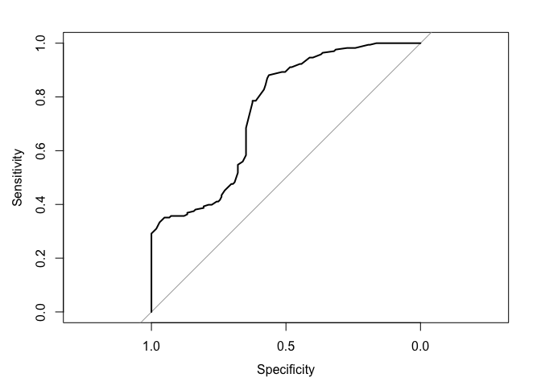
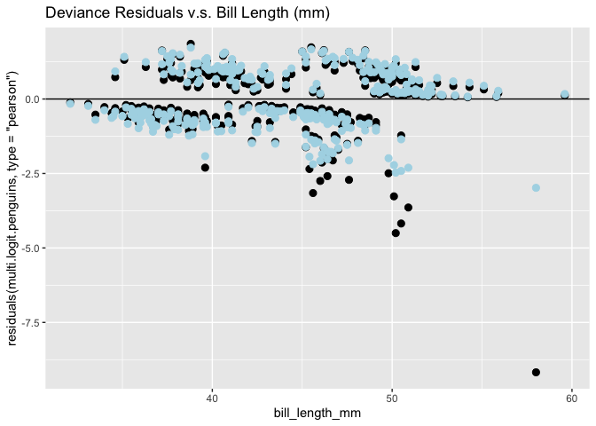
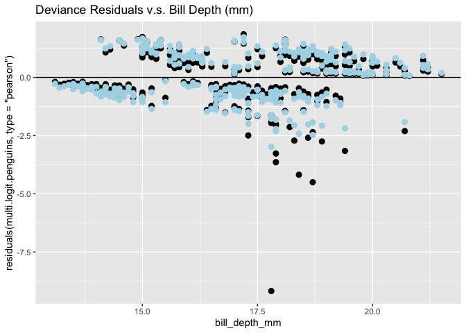

Logistic Regression model for Palmer Penguins Data Set
================
Ethan Bensadoun
2024-08-15

## Part 1

``` r
library(palmerpenguins) # You may need to install this package
library(tidyverse) # You may need to install this package
```

    ## ── Attaching core tidyverse packages ──────────────────────── tidyverse 2.0.0 ──
    ## ✔ dplyr     1.1.2     ✔ readr     2.1.4
    ## ✔ forcats   1.0.0     ✔ stringr   1.5.0
    ## ✔ ggplot2   3.4.3     ✔ tibble    3.2.1
    ## ✔ lubridate 1.9.2     ✔ tidyr     1.3.0
    ## ✔ purrr     1.0.1     
    ## ── Conflicts ────────────────────────────────────────── tidyverse_conflicts() ──
    ## ✖ dplyr::filter() masks stats::filter()
    ## ✖ dplyr::lag()    masks stats::lag()
    ## ℹ Use the conflicted package (<http://conflicted.r-lib.org/>) to force all conflicts to become errors

``` r
data(penguins)
penguins_complete <- penguins %>% drop_na()
view(penguins_complete)
```

## (a)

logit regression model can be modeled by the following:

``` r
logit.penguins = glm(sex~body_mass_g,family=binomial,data=penguins_complete)
summary(logit.penguins)
```

    ## 
    ## Call:
    ## glm(formula = sex ~ body_mass_g, family = binomial, data = penguins_complete)
    ## 
    ## Coefficients:
    ##               Estimate Std. Error z value Pr(>|z|)    
    ## (Intercept) -5.1625416  0.7243906  -7.127 1.03e-12 ***
    ## body_mass_g  0.0012398  0.0001727   7.177 7.10e-13 ***
    ## ---
    ## Signif. codes:  0 '***' 0.001 '**' 0.01 '*' 0.05 '.' 0.1 ' ' 1
    ## 
    ## (Dispersion parameter for binomial family taken to be 1)
    ## 
    ##     Null deviance: 461.61  on 332  degrees of freedom
    ## Residual deviance: 396.64  on 331  degrees of freedom
    ## AIC: 400.64
    ## 
    ## Number of Fisher Scoring iterations: 4

As a result we can write out the logistic equation like this:

p = exp(-5.1625416 + 0.0012398*body_mass_g)/ (1 + exp(-5.1625416 +
0.0012398*body_mass_g))

## (b)

null hypothesis test:

From the summary output in part(a) of the problem we can see that the
coefficient of the body_mass_g variable, Beta1, is 0.0012398.

Thus, we can set up the null and alternative hypotheses:

H0: Beta1 = 0

H1: Beta1 =!0

w/ a Type I error of alpha = 0.05 Thus, the confidence level of this
test should be:  
(1-alpha)x100 =\> 95% confidence level

In addition, the p-value for the given variable Beta1 is: 7.10e-13

As a result, alpha \> p-value =\> 0.05 \> 7.10e-13

Thus, we can reject the null hypothesis because the p-value is less than
given alpha. Thus, the result is statistically significant, i.e., we can
be 95% confident that a higher body_mass_g is related to a specific sex
of the penguin population.

## (c)

``` r
Beta1.hat <- 0.0012398
exp.Beta1 <- exp(Beta1.hat)
exp.Beta1
```

    ## [1] 1.001241

``` r
# or we can just this function, which yields the same result:
exp(coef(logit.penguins)[2])
```

    ## body_mass_g 
    ##    1.001241

The penguin mass coefficient signifies the rise in log-odds of a penguin
being male or the proportional alteration in the odds of a penguin being
male itself when its body mass increases by one gram. According to the
finding, a one-gram increase in a penguin’s body mass results in a
0.00124 increase in the likelihood of it being male.

## (d)

``` r
confint.default(logit.penguins)
```

    ##                     2.5 %       97.5 %
    ## (Intercept) -6.5823210639 -3.742762224
    ## body_mass_g  0.0009012591  0.001578379

``` r
# If we want the odds ratio, instead of the log-odds ratio, we simply need to exponentiation the estimate (or endpoints of the interval):
exp(confint.default(logit.penguins))
```

    ##                   2.5 %     97.5 %
    ## (Intercept) 0.001384632 0.02368858
    ## body_mass_g 1.000901665 1.00157963

``` r
penguins_complete = penguins_complete %>% mutate(phat_eh = predict(logit.penguins,type="response"))
# this adds a new column to our penguins_complete table with all the phat ()
```

``` r
# the logistic equation, represents the fitted values on the curve (in this case for x=3500):
# phat = exp(Beta0.hat + Beta1.hat*body_mass_g)/ (1 + exp(Beta0.hat + Beta1.hat*body_mass_g))
Beta0.hat <- -5.1625416
Beta1.hat <- 0.0012398
phat = exp(Beta0.hat + Beta1.hat*3500)/ (1 + exp(Beta0.hat + Beta1.hat*3500))
phat
```

    ## [1] 0.305076

``` r
exp(confint(logit.penguins,"body_mass_g"))
```

    ## Waiting for profiling to be done...

    ##    2.5 %   97.5 % 
    ## 1.000913 1.001593

``` r
exp(confint.default(logit.penguins,"body_mass_g"))
```

    ##                2.5 %  97.5 %
    ## body_mass_g 1.000902 1.00158

## (e)

``` r
library(pROC)
```

    ## Type 'citation("pROC")' for a citation.

    ## 
    ## Attaching package: 'pROC'

    ## The following objects are masked from 'package:stats':
    ## 
    ##     cov, smooth, var

``` r
penguins.roc = roc(sex~fitted(logit.penguins),data=penguins_complete)
```

    ## Setting levels: control = female, case = male

    ## Setting direction: controls < cases

``` r
plot(penguins.roc)
```

<!-- -->

Judging from the ROC curve displayed, we can conclude that the weight
predictor offers only moderate predictive capability for determining the
sex within the Palmer penguin dataset. If the curve were precisely along
the diagonal line, we would consider the model to have predictive
strength equivalent to random chance, like a coin flip. However,
particularly at the extremes of penguin weights, employing weight as a
predictor for sex appears to be a promising approach, indicated by the
larger area under the curve.

## Part 2

## a)

``` r
data(penguins)
penguins_complete <- penguins %>% drop_na()
multi.logit.penguins <- glm(sex ~ bill_depth_mm + bill_length_mm, family = binomial, data = penguins_complete)
# multiple logistic regression model fit with bill length and depth to sex
summary(multi.logit.penguins)
```

    ## 
    ## Call:
    ## glm(formula = sex ~ bill_depth_mm + bill_length_mm, family = binomial, 
    ##     data = penguins_complete)
    ## 
    ## Coefficients:
    ##                 Estimate Std. Error z value Pr(>|z|)    
    ## (Intercept)    -24.94444    2.89052  -8.630  < 2e-16 ***
    ## bill_depth_mm    0.76716    0.09709   7.901 2.76e-15 ***
    ## bill_length_mm   0.27107    0.03567   7.600 2.97e-14 ***
    ## ---
    ## Signif. codes:  0 '***' 0.001 '**' 0.01 '*' 0.05 '.' 0.1 ' ' 1
    ## 
    ## (Dispersion parameter for binomial family taken to be 1)
    ## 
    ##     Null deviance: 461.61  on 332  degrees of freedom
    ## Residual deviance: 323.64  on 330  degrees of freedom
    ## AIC: 329.64
    ## 
    ## Number of Fisher Scoring iterations: 5

## b)

We observe a positive association between both bill length and depth and
the response variable, sex. The coefficient for bill length indicates
the increase in the log-odds of a penguin being male, or the
proportional change to the odds of a penguin being male, with a one
millimeter increase in bill length. Similarly, the coefficient for bill
depth represents the increase in the log-odds of a penguin being male
with a one millimeter change in bill depth. The model summary provides
z-statistics regarding the significance of each covariate. The critical
value for testing the significance of the covariate estimates is the
following:

``` r
qt(0.05, nrow(penguins_complete)-2, lower.tail = FALSE)
```

    ## [1] 1.64947

``` r
qt(0.01, nrow(penguins_complete)-2, lower.tail = FALSE)
```

    ## [1] 2.337666

We can clearly see that both covariate z-values exceed both of these
thresholds. Moreover, the corresponding p-values significantly fall
below conventional significance levels of .05 or .01. Therefore, we can
assert that the covariate values are statistically significant and that
there is a plausible positive correlation between the length and depth
of the Palmer penguins’ bills and their likelihood of being male.

## c)

Now we can use stepAIC() in order to contrast the models and choose the
“best” model:

``` r
stepAIC(multi.logit.penguins)
```

    ## Start:  AIC=329.64
    ## sex ~ bill_depth_mm + bill_length_mm
    ## 
    ##                  Df Deviance    AIC
    ## <none>                323.64 329.64
    ## - bill_length_mm  1   412.89 416.89
    ## - bill_depth_mm   1   420.42 424.42

    ## 
    ## Call:  glm(formula = sex ~ bill_depth_mm + bill_length_mm, family = binomial, 
    ##     data = penguins_complete)
    ## 
    ## Coefficients:
    ##    (Intercept)   bill_depth_mm  bill_length_mm  
    ##       -24.9444          0.7672          0.2711  
    ## 
    ## Degrees of Freedom: 332 Total (i.e. Null);  330 Residual
    ## Null Deviance:       461.6 
    ## Residual Deviance: 323.6     AIC: 329.6

``` r
stepAIC(glm(sex~bill_depth_mm, family=binomial, data=penguins_complete))
```

    ## Start:  AIC=416.89
    ## sex ~ bill_depth_mm
    ## 
    ##                 Df Deviance    AIC
    ## <none>               412.89 416.89
    ## - bill_depth_mm  1   461.61 463.61

    ## 
    ## Call:  glm(formula = sex ~ bill_depth_mm, family = binomial, data = penguins_complete)
    ## 
    ## Coefficients:
    ##   (Intercept)  bill_depth_mm  
    ##       -7.2280         0.4219  
    ## 
    ## Degrees of Freedom: 332 Total (i.e. Null);  331 Residual
    ## Null Deviance:       461.6 
    ## Residual Deviance: 412.9     AIC: 416.9

``` r
stepAIC(glm(sex~bill_length_mm, family=binomial, data=penguins_complete))
```

    ## Start:  AIC=424.42
    ## sex ~ bill_length_mm
    ## 
    ##                  Df Deviance    AIC
    ## <none>                420.42 424.42
    ## - bill_length_mm  1   461.61 463.61

    ## 
    ## Call:  glm(formula = sex ~ bill_length_mm, family = binomial, data = penguins_complete)
    ## 
    ## Coefficients:
    ##    (Intercept)  bill_length_mm  
    ##        -6.0367          0.1377  
    ## 
    ## Degrees of Freedom: 332 Total (i.e. Null);  331 Residual
    ## Null Deviance:       461.6 
    ## Residual Deviance: 420.4     AIC: 424.4

## d)

Plotting Pearson and deviance residuals:

``` r
ggplot(data=penguins_complete,
       aes(y=residuals(multi.logit.penguins,type="pearson"),x=bill_length_mm)) + 
  geom_point(size=2.5) + geom_hline(yintercept=0)  + ggtitle("Deviance Residuals v.s. Bill Length (mm)") + 
  geom_point(aes(y=residuals(multi.logit.penguins,type="deviance")), col="lightblue",size=2.5)
```

<!-- -->

``` r
ggplot(data=penguins_complete, aes(y = residuals(multi.logit.penguins,type="pearson"), x = bill_depth_mm)) + 
  geom_point(size=2.5) + 
  geom_hline(yintercept=0) + 
  ggtitle("Deviance Residuals v.s. Bill Depth (mm)") + 
  geom_point(aes(y=residuals(multi.logit.penguins,type="deviance")), col="lightblue",size=2.5)
```

<!-- -->

Overall, the data demonstrates a good fit in the vicinity of the sample
mean, but there are notable outliers in both graphs that fall short of
expectations. For instance, certain penguins with a specific bill length
are expected by the model to be more likely male, yet they are not. This
pattern is also observed in bill depth, albeit to a lesser degree, as
some outliers are closer to the sample mean, warranting comparatively
less concern.

The figures show that the ‘clean’ Palmer penguin data contains numerous
data points that are poorly aligned. Particularly troubling are those
data points that deviate significantly from the mean of either bill
length or depth. These outliers are concerning as they exhibit a higher
level of discrepancy than anticipated and are adjusted for their
disproportionate influence.

## e)

``` r
null.model <- glm(sex~1, family = binomial, data = penguins_complete)
n <- nrow(penguins_complete)

# Nagel and McFadden
Nagel = (1-((exp(logLik(null.model)))/exp(logLik(multi.logit.penguins))))^(2/n)/
    (1-exp(logLik(null.model)))^(2/n)
McFadden = 1 - logLik(multi.logit.penguins)/logLik(null.model)
print(Nagel)
```

    ## 'log Lik.' 1 (df=1)

``` r
print(McFadden)
```

    ## 'log Lik.' 0.2988923 (df=3)

The McFadden model fit statistic suggests that around 29.9% of the
deviance in the data is accounted for by the model fit in (a).
Consequently, a significant portion remains unexplained by the model,
indicating it may not be a strong fit for the data.

The Nagelkerke model fit statistic is a measure used in logistic
regression models to assess the overall fit of the model to the data.
This statistic ranges from 0 to 1, with higher values indicating a
better fit of the model to the data, in our case we have 1 as the
result. It provides an estimate of the proportion of variation explained
by the multi.logit.penguins model relative to the maximum possible
variation, thus, the result is good.
