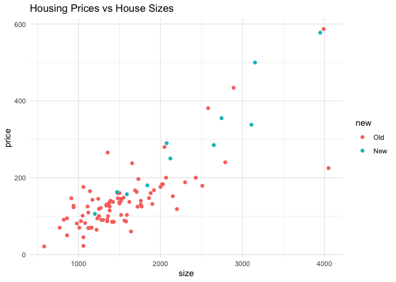
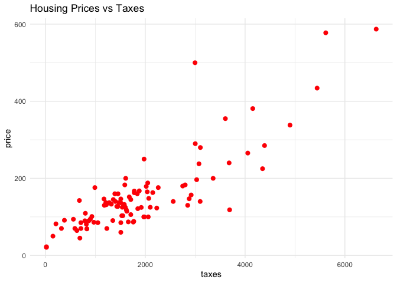
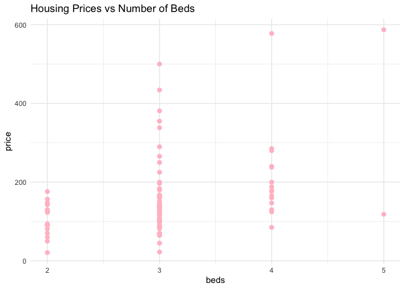
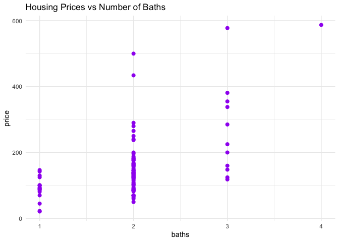
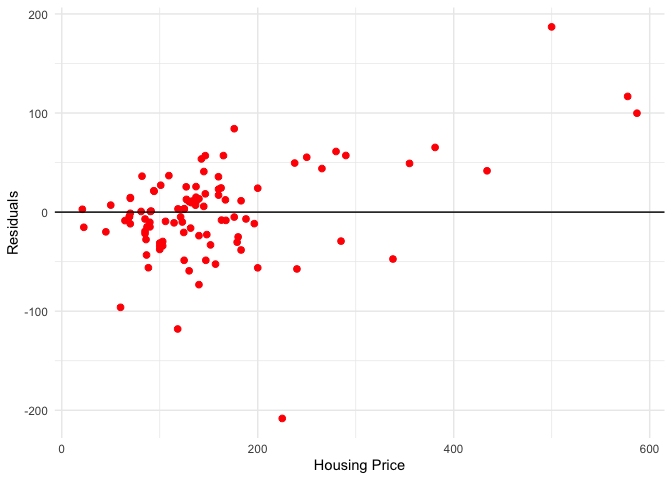
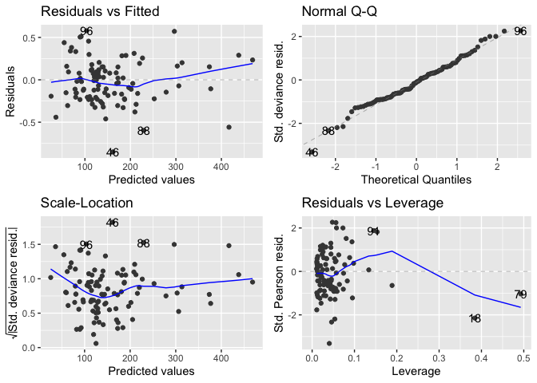
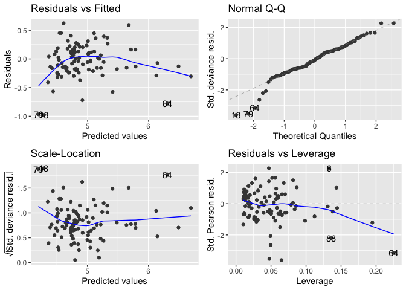

Normal and Gamma Model to Predict Housing Prices in Florida
================
Ethan Bensadoun
2024-08-15

## Part 1

``` r
library(tidyverse)
```

    ## ── Attaching core tidyverse packages ──────────────────────── tidyverse 2.0.0 ──
    ## ✔ dplyr     1.1.2     ✔ readr     2.1.4
    ## ✔ forcats   1.0.0     ✔ stringr   1.5.0
    ## ✔ ggplot2   3.4.3     ✔ tibble    3.2.1
    ## ✔ lubridate 1.9.2     ✔ tidyr     1.3.0
    ## ✔ purrr     1.0.1     
    ## ── Conflicts ────────────────────────────────────────── tidyverse_conflicts() ──
    ## ✖ dplyr::filter() masks stats::filter()
    ## ✖ dplyr::lag()    masks stats::lag()
    ## ℹ Use the conflicted package (<http://conflicted.r-lib.org/>) to force all conflicts to become errors

``` r
library(ggplot2)
library(dplyr)
library(MASS)
```

    ## 
    ## Attaching package: 'MASS'
    ## 
    ## The following object is masked from 'package:dplyr':
    ## 
    ##     select

``` r
library(ggrepel)
```

``` r
Houses <- read_table("http://www.stat.ufl.edu/~aa/glm/data/Houses.dat")
```

    ## Warning: Missing column names filled in: 'X8' [8]

    ## 
    ## ── Column specification ────────────────────────────────────────────────────────
    ## cols(
    ##   case = col_double(),
    ##   taxes = col_double(),
    ##   beds = col_double(),
    ##   baths = col_double(),
    ##   new = col_double(),
    ##   price = col_double(),
    ##   size = col_double(),
    ##   X8 = col_logical()
    ## )

``` r
# we can drop the X8 column (that is filled with NAs) by subsetting the Houses data set
Houses <- subset(Houses, select = -X8)
str(Houses)
```

    ## tibble [100 × 7] (S3: tbl_df/tbl/data.frame)
    ##  $ case : num [1:100] 1 2 3 4 5 6 7 8 9 10 ...
    ##  $ taxes: num [1:100] 3104 1173 3076 1608 1454 ...
    ##  $ beds : num [1:100] 4 2 4 3 3 3 3 3 5 3 ...
    ##  $ baths: num [1:100] 2 1 2 2 3 2 2 2 4 2 ...
    ##  $ new  : num [1:100] 0 0 0 0 0 1 0 1 0 0 ...
    ##  $ price: num [1:100] 280 146 238 200 160 ...
    ##  $ size : num [1:100] 2048 912 1654 2068 1477 ...

``` r
print(Houses)
```

    ## # A tibble: 100 × 7
    ##     case taxes  beds baths   new price  size
    ##    <dbl> <dbl> <dbl> <dbl> <dbl> <dbl> <dbl>
    ##  1     1  3104     4     2     0  280.  2048
    ##  2     2  1173     2     1     0  146.   912
    ##  3     3  3076     4     2     0  238.  1654
    ##  4     4  1608     3     2     0  200   2068
    ##  5     5  1454     3     3     0  160.  1477
    ##  6     6  2997     3     2     1  500.  3153
    ##  7     7  4054     3     2     0  266.  1355
    ##  8     8  3002     3     2     1  290.  2075
    ##  9     9  6627     5     4     0  587   3990
    ## 10    10   320     3     2     0   70   1160
    ## # ℹ 90 more rows

From the given data table on house data in Florida, has the following
variables (for 100 observations) listed: - selling price (in thousands
of dollars) - size of house (in square feet) - annual property tax bill
(in dollars) - number of bedrooms - number of bathrooms - whether the
house is new

According to section 3.4 in the textbook, the 100 observations are from
one city alone, i.e, Gainseville. Thus, any inferences does not imply
the relationships in general. They are treated as a random sample for
illustrative purposes.

Here are the following summary statistics and plots:

## 3a)

``` r
summary(Houses)
```

    ##       case            taxes           beds       baths           new      
    ##  Min.   :  1.00   Min.   :  20   Min.   :2   Min.   :1.00   Min.   :0.00  
    ##  1st Qu.: 25.75   1st Qu.:1178   1st Qu.:3   1st Qu.:2.00   1st Qu.:0.00  
    ##  Median : 50.50   Median :1614   Median :3   Median :2.00   Median :0.00  
    ##  Mean   : 50.50   Mean   :1908   Mean   :3   Mean   :1.96   Mean   :0.11  
    ##  3rd Qu.: 75.25   3rd Qu.:2238   3rd Qu.:3   3rd Qu.:2.00   3rd Qu.:0.00  
    ##  Max.   :100.00   Max.   :6627   Max.   :5   Max.   :4.00   Max.   :1.00  
    ##      price             size     
    ##  Min.   : 21.00   Min.   : 580  
    ##  1st Qu.: 93.22   1st Qu.:1215  
    ##  Median :132.60   Median :1474  
    ##  Mean   :155.33   Mean   :1629  
    ##  3rd Qu.:169.62   3rd Qu.:1865  
    ##  Max.   :587.00   Max.   :4050

``` r
# Below we can see the the descriptive statistics for all 
# the different variables (i.e., columns) in the Houses dataset
```

``` r
# For modelling y = selling price 
Houses_plot <- Houses
Houses_plot$new <- factor(Houses$new, levels = c(0, 1), labels = c("Old", "New"))


# Now plot, allowing ggplot2 to handle the coloring based on the factor levels
plot <- ggplot(Houses_plot, aes(x = size, y = price)) +
  geom_point(aes(color = new), stroke = 1, size = 1) +  
  # Use 'color' within aes for 'new' as factor
  ggtitle("Housing Prices vs House Sizes") + theme_minimal()
# Print the plot
print(plot)
```

<!-- -->

``` r
# x-axis represents size 

ggplot(Houses, aes(x=taxes , y=price)) + 
  geom_point(colour="red",stroke=1) + 
  ggtitle("Housing Prices vs Taxes") + theme_minimal() 
```

<!-- -->

``` r
# x-axis represents taxes 

ggplot(Houses, aes(x=beds , y=price)) + 
  geom_point(colour="pink",stroke=1) + 
  ggtitle("Housing Prices vs Number of Beds") + theme_minimal()
```

<!-- -->

``` r
# x-axis represents beds 

ggplot(Houses, aes(x=baths , y=price)) + 
  geom_point(colour="purple",stroke=1) + 
  ggtitle("Housing Prices vs Number of Baths") + theme_minimal()
```

<!-- -->

``` r
# x-axis represents baths 
```

## 3b)

``` r
# We need to fit the model using the glm function 
House_fit <- glm(price ~  size + beds + baths + taxes, 
                 family=gaussian(link=identity), data=Houses_plot)
# The response variable follows a normal distribution, which is appropriate 
# for continuous outcome data.
# The identity link implies that changes in the predictors 
# have a direct and additive effect on the response variable's scale.
summary(House_fit)
```

    ## 
    ## Call:
    ## glm(formula = price ~ size + beds + baths + taxes, family = gaussian(link = identity), 
    ##     data = Houses_plot)
    ## 
    ## Coefficients:
    ##               Estimate Std. Error t value Pr(>|t|)    
    ## (Intercept)   7.699131  25.087877   0.307   0.7596    
    ## size          0.074603   0.014068   5.303  7.4e-07 ***
    ## beds        -16.142182   9.133788  -1.767   0.0804 .  
    ## baths        -1.344977  11.764548  -0.114   0.9092    
    ## taxes         0.040425   0.006931   5.833  7.5e-08 ***
    ## ---
    ## Signif. codes:  0 '***' 0.001 '**' 0.01 '*' 0.05 '.' 0.1 ' ' 1
    ## 
    ## (Dispersion parameter for gaussian family taken to be 2351.243)
    ## 
    ##     Null deviance: 1015150  on 99  degrees of freedom
    ## Residual deviance:  223368  on 95  degrees of freedom
    ## AIC: 1066.9
    ## 
    ## Number of Fisher Scoring iterations: 2

The decision to choose this model is based on its fundamental nature as
a linear model. The ‘new’ covariate is omitted from our analysis due to
its binomial nature, which causes integration challenges when combined
with other continuous or discrete non-binomial covariates in the
modeling process. It would make more sense to run a logit regression
model for binary covariates.

``` r
# Next we can use the stepAIC() function with a forward direction 
# in order to select forward, starting with the null model, adding terms 
# in order to improve the fit. 
stepAIC(House_fit, direction = "forward")
```

    ## Start:  AIC=1066.93
    ## price ~ size + beds + baths + taxes

    ## 
    ## Call:  glm(formula = price ~ size + beds + baths + taxes, family = gaussian(link = identity), 
    ##     data = Houses_plot)
    ## 
    ## Coefficients:
    ## (Intercept)         size         beds        baths        taxes  
    ##     7.69913      0.07460    -16.14218     -1.34498      0.04042  
    ## 
    ## Degrees of Freedom: 99 Total (i.e. Null);  95 Residual
    ## Null Deviance:       1015000 
    ## Residual Deviance: 223400    AIC: 1067

``` r
# Notice that the case column is not included in the output, since it it just 
# an ascending list that is there to identify the housing unit.
```

We can interpret the result above from the House_fit and StepAIC summary
output:

- There seems to be a positive correlation between the price of a
  housing unit and size/taxes (as the coefficients are positive).

- Thus, we can assume a correlation between increasing housing prices
  and and increase in size or taxes. - Specifically, a 1 unit rise in
  taxes correlates with a .040 unit increase in price, while a 1 unit
  rise in house size correlates with a .0746 unit increase in price.

- The positive correlation between taxes and price suggests that higher
  taxes are likely a consequence of higher house values, rather than
  being a direct value-adding factor.

- On the other hand, there seems to be a negative correlation between
  the price of a housing unit and beds/baths (as the coefficients are
  negative, -16.14218 and -1.34498). Thus, these covariates show a
  negative correlation with price, suggesting these factors might not
  always enhance house value as expected.

- Note, one could assume that an increase in bedrooms and bathrooms
  might lead to an increase in the housing unit’s value, running
  stepAIC() identifies a negative correlation as previously mentioned.
  Thus, we can attribute this result to the wide value ranges for houses
  with the same number of beds and baths. Where some points might be
  weighted differently, negatively impacting the correlations for these
  covariates in the model.

Notice also that in the summary output table of House_fit, there are 3
stars on the right side of the p-values for size and taxes, which can be
attributed by financial considerations in housing decisions (i.e., as
the size if the house increases, the more the unit is taxed). This is a
statistically significant result of the model.

## 3c)

``` r
ggplot(data=Houses_plot,aes(y=residuals(House_fit),x=price)) + 
  geom_point(color = "red", aplha = 0.5, size=2) + 
  xlab("Housing Price") + ylab("Residuals") + 
  geom_hline(yintercept = 0) + theme_minimal()
```

    ## Warning in geom_point(color = "red", aplha = 0.5, size = 2): Ignoring unknown
    ## parameters: `aplha`

<!-- -->

- Notice the 3 outliers in the top right corner of the graph. Their
  position is considered to be highly influential indicating both high
  residuals and high prices. This discrepancy suggests that the model
  does not fully capture the pattern for these points, thus, they can
  disproportionally influence the model covariates as I previously
  mentioned in part(b). They can have more leverage, which inevitably
  affects the slope of the fitted model which skews model predictions
  about housing prices.
- In the summary output in part(b) we can see the null deviance is
  1015000 (99 df) and residual deviance is 223400 (95 df). This
  reduction in deviance is good because it implies that adding a
  predictor provides a better fit. Thus, the covariates explain a
  significant portion of the variability in the housing price response
  variable. This improves the goodness of fit of the model.

## Part 2

``` r
library(tidyverse)
library(ggplot2)
library(dplyr)
library(MASS)
library(ggrepel)
library(ggfortify)
```

## Including Plots

You can also embed plots, for example:

    ## Warning: Missing column names filled in: 'X8' [8]

    ## 
    ## ── Column specification ────────────────────────────────────────────────────────
    ## cols(
    ##   case = col_double(),
    ##   taxes = col_double(),
    ##   beds = col_double(),
    ##   baths = col_double(),
    ##   new = col_double(),
    ##   price = col_double(),
    ##   size = col_double(),
    ##   X8 = col_logical()
    ## )

    ## tibble [100 × 7] (S3: tbl_df/tbl/data.frame)
    ##  $ case : num [1:100] 1 2 3 4 5 6 7 8 9 10 ...
    ##  $ taxes: num [1:100] 3104 1173 3076 1608 1454 ...
    ##  $ beds : num [1:100] 4 2 4 3 3 3 3 3 5 3 ...
    ##  $ baths: num [1:100] 2 1 2 2 3 2 2 2 4 2 ...
    ##  $ new  : num [1:100] 0 0 0 0 0 1 0 1 0 0 ...
    ##  $ price: num [1:100] 280 146 238 200 160 ...
    ##  $ size : num [1:100] 2048 912 1654 2068 1477 ...

    ## # A tibble: 100 × 7
    ##     case taxes  beds baths   new price  size
    ##    <dbl> <dbl> <dbl> <dbl> <dbl> <dbl> <dbl>
    ##  1     1  3104     4     2     0  280.  2048
    ##  2     2  1173     2     1     0  146.   912
    ##  3     3  3076     4     2     0  238.  1654
    ##  4     4  1608     3     2     0  200   2068
    ##  5     5  1454     3     3     0  160.  1477
    ##  6     6  2997     3     2     1  500.  3153
    ##  7     7  4054     3     2     0  266.  1355
    ##  8     8  3002     3     2     1  290.  2075
    ##  9     9  6627     5     4     0  587   3990
    ## 10    10   320     3     2     0   70   1160
    ## # ℹ 90 more rows

## 4a)

``` r
Houses_fit2 <-glm(price ~ size + taxes + beds + baths, 
                  family=Gamma(log),data=Houses)
summary(Houses_fit2)
```

    ## 
    ## Call:
    ## glm(formula = price ~ size + taxes + beds + baths, family = Gamma(log), 
    ##     data = Houses)
    ## 
    ## Coefficients:
    ##               Estimate Std. Error t value Pr(>|t|)    
    ## (Intercept)  4.115e+00  1.451e-01  28.357  < 2e-16 ***
    ## size         3.269e-04  8.136e-05   4.018 0.000117 ***
    ## taxes        2.275e-04  4.008e-05   5.674  1.5e-07 ***
    ## beds        -7.203e-02  5.283e-02  -1.363 0.175955    
    ## baths        3.222e-02  6.804e-02   0.474 0.636899    
    ## ---
    ## Signif. codes:  0 '***' 0.001 '**' 0.01 '*' 0.05 '.' 0.1 ' ' 1
    ## 
    ## (Dispersion parameter for Gamma family taken to be 0.07865152)
    ## 
    ##     Null deviance: 31.9401  on 99  degrees of freedom
    ## Residual deviance:  8.5167  on 95  degrees of freedom
    ## AIC: 1028.1
    ## 
    ## Number of Fisher Scoring iterations: 5

``` r
Step_House <- stepAIC(Houses_fit2, direction = "forward")
```

    ## Start:  AIC=1028.06
    ## price ~ size + taxes + beds + baths

``` r
summary(Step_House)
```

    ## 
    ## Call:
    ## glm(formula = price ~ size + taxes + beds + baths, family = Gamma(log), 
    ##     data = Houses)
    ## 
    ## Coefficients:
    ##               Estimate Std. Error t value Pr(>|t|)    
    ## (Intercept)  4.115e+00  1.451e-01  28.357  < 2e-16 ***
    ## size         3.269e-04  8.136e-05   4.018 0.000117 ***
    ## taxes        2.275e-04  4.008e-05   5.674  1.5e-07 ***
    ## beds        -7.203e-02  5.283e-02  -1.363 0.175955    
    ## baths        3.222e-02  6.804e-02   0.474 0.636899    
    ## ---
    ## Signif. codes:  0 '***' 0.001 '**' 0.01 '*' 0.05 '.' 0.1 ' ' 1
    ## 
    ## (Dispersion parameter for Gamma family taken to be 0.07865152)
    ## 
    ##     Null deviance: 31.9401  on 99  degrees of freedom
    ## Residual deviance:  8.5167  on 95  degrees of freedom
    ## AIC: 1028.1
    ## 
    ## Number of Fisher Scoring iterations: 5

In the model above, we can interpret the coefficients of each covariate
as follows:

- Size: 3.269e-04, which indicates that for additional unit of size is
  associated with a 0.0327% increase in home value.
- Taxes: 2.275e-04, which indicates that an increase in taxes paid by
  one unit results in a 0.0227% increase in home value.
- Beds: -7.203e-02, which indicates that adding one bedroom to a house
  is linked to a 6.95% decrease in its value (because 1-.9305 = 0.0695).
- Baths: 3.222e-02, which indicates that Each extra bathroom contributes
  to a 3.27% rise in home value.

The output also indicates that price, size and taxes are statistically
significant (three stars). Where the 2 covariates have a p-value of
2e-16 and 0.000117. The other covariates (i.e., coefficients) won’t have
an intuitive correlation with home price since the p-values are not
statistically siginificant, thus, we cannot say we are as fully
confident with those results. There isn’t evidence to say whether
changing those variables will have a systematic effect on the housing
price.

## 4.b)

``` r
Houses_fit3 <-glm(price ~ size + taxes + beds + baths, 
                  family=Gamma(link = identity),data=Houses)
summary(Houses_fit3)
```

    ## 
    ## Call:
    ## glm(formula = price ~ size + taxes + beds + baths, family = Gamma(link = identity), 
    ##     data = Houses)
    ## 
    ## Coefficients:
    ##               Estimate Std. Error t value Pr(>|t|)    
    ## (Intercept)  18.860815  13.711268   1.376  0.17219    
    ## size          0.065148   0.012452   5.232 9.98e-07 ***
    ## taxes         0.038452   0.005017   7.664 1.53e-11 ***
    ## beds        -20.678022   6.286555  -3.289  0.00141 ** 
    ## baths         9.585793   6.491052   1.477  0.14304    
    ## ---
    ## Signif. codes:  0 '***' 0.001 '**' 0.01 '*' 0.05 '.' 0.1 ' ' 1
    ## 
    ## (Dispersion parameter for Gamma family taken to be 0.06861316)
    ## 
    ##     Null deviance: 31.9401  on 99  degrees of freedom
    ## Residual deviance:  6.6025  on 95  degrees of freedom
    ## AIC: 1002.3
    ## 
    ## Number of Fisher Scoring iterations: 7

``` r
Step_House2 <- stepAIC(Houses_fit3, direction = "forward")
```

    ## Start:  AIC=1002.29
    ## price ~ size + taxes + beds + baths

``` r
summary(Step_House2)
```

    ## 
    ## Call:
    ## glm(formula = price ~ size + taxes + beds + baths, family = Gamma(link = identity), 
    ##     data = Houses)
    ## 
    ## Coefficients:
    ##               Estimate Std. Error t value Pr(>|t|)    
    ## (Intercept)  18.860815  13.711268   1.376  0.17219    
    ## size          0.065148   0.012452   5.232 9.98e-07 ***
    ## taxes         0.038452   0.005017   7.664 1.53e-11 ***
    ## beds        -20.678022   6.286555  -3.289  0.00141 ** 
    ## baths         9.585793   6.491052   1.477  0.14304    
    ## ---
    ## Signif. codes:  0 '***' 0.001 '**' 0.01 '*' 0.05 '.' 0.1 ' ' 1
    ## 
    ## (Dispersion parameter for Gamma family taken to be 0.06861316)
    ## 
    ##     Null deviance: 31.9401  on 99  degrees of freedom
    ## Residual deviance:  6.6025  on 95  degrees of freedom
    ## AIC: 1002.3
    ## 
    ## Number of Fisher Scoring iterations: 7

For the adjusted model where link = identity, we can make the following
interpretations of the coefficients:

- Size: 0.065148, for an additional unit of size is associated with a
  0.0651 units increase in home value.
- Taxes: 0.038452, A one-unit increase in taxes paid boosts the home’s
  value by approximately 0.0385 units.
- Beds: -20.678022, adding a bedroom to the house reduces its value by
  about 20.68 units.
- Baths: 9.585793, an additional bathroom raises the home’s value by
  around 9.583 units.

Note there is statistical significance for the covariates size and taxes
(sames as part a), with p-values 9.98e-07 and 1.53e-11. Note that beds
is also statistically significant with a p-value of 0.00141. However,
the covariate is not significant to the same degree as the other two.

Note that there is model has lower residual deviance of 6.6025 (95 df)
whereas in (a), the residual deviance was 8.5167 (95 df). Thus, we can
see an improvement in the performance of the statistical model in terms
of how well it fits the data. They both outperform the intercept-only
model which has a null deviance of 31.9401.

These findings are reminiscent of those in section (b) of Question 3,
where the covariates’size’ and ‘taxes’ were significant, and ‘beds’
showed some significance as well. Another point of comparison is that,
despite not being statistically significant, the estimated effect of
bedrooms on house price is the most substantial in this model and in
section (b) of Question 3. That is, the addition of bedrooms contributes
most significantly to changes in the house price, according to the
estimates produced by these models using stepAIC().

## 4.c)

We can analyze the leverage of the models using the following functions:

``` r
autoplot(Step_House2)
```

<!-- -->

Residual vs Fitted Plot: the plot in the top left corner indicates a
high variability in the residuals across the data spectrum, which
implies the highest predicted prices. With a particular emphasis on
points at the extreme right end.

Normal QQ Plot: It is definitely fitted as the points are on the line,
however, there are some outliers that deviate from the line, which
implies deviations from the fitted model.

Scale-Location Plot: We can see that the residuals seem to be more
random as the line is more horizontal.

Residual vs Leverage Plot: It demonstrates that many data points exert a
considerable influence on the model’s outcomes, as they are bunched up
to the right and near 0.

``` r
autoplot(Step_House)
```

<!-- -->

Residual vs Fitted Plot: the plot in the top left corner indicates a
high variability in the residuals across the data spectrum, which
implies the highest predicted prices. With a particular emphasis on
points at the extreme right end.

Normal QQ Plot: It is definitely fitted as the points are on the line,
however, there are some outliers that deviate from the line, which
implies deviations from the fitted model. At the bottom on the left
there seems to be more outliers that drop off from the fitted line.

Scale-Location Plot: We can see that the residuals seem to be more
random as the line is more horizontal.

Residual vs Leverage Plot: The plot indicates that many data points
significantly influence the model’s predictions.

- Lastly, we notice certain similarities from the model in q3.
  Specifically with the scale-location and residual plots. Specifically
  where the points bunch up to the left.
